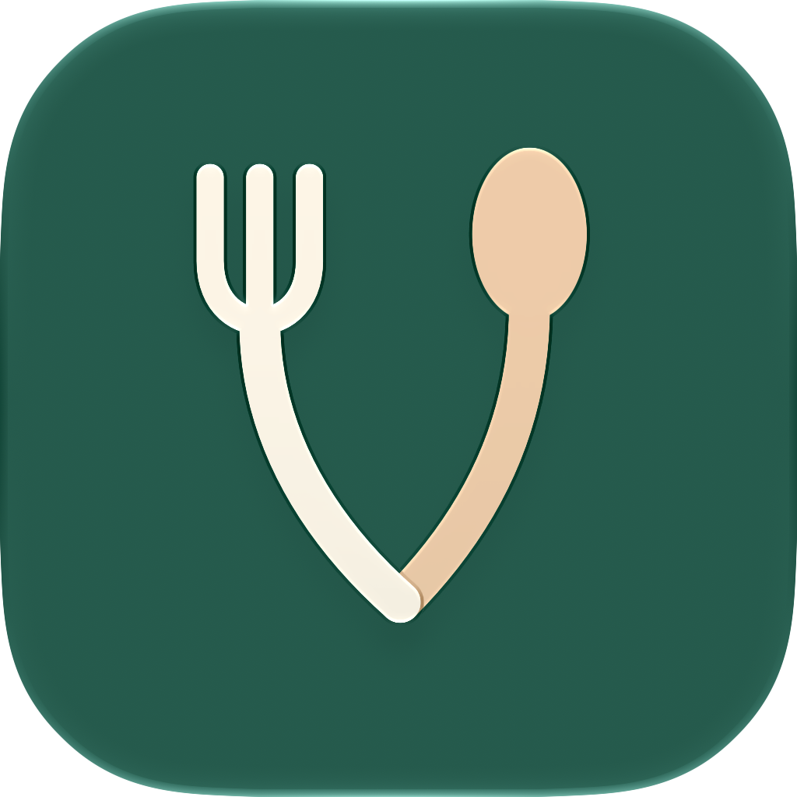
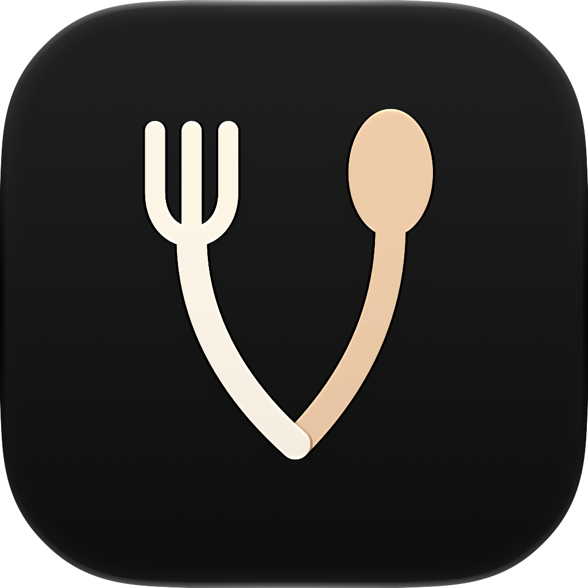
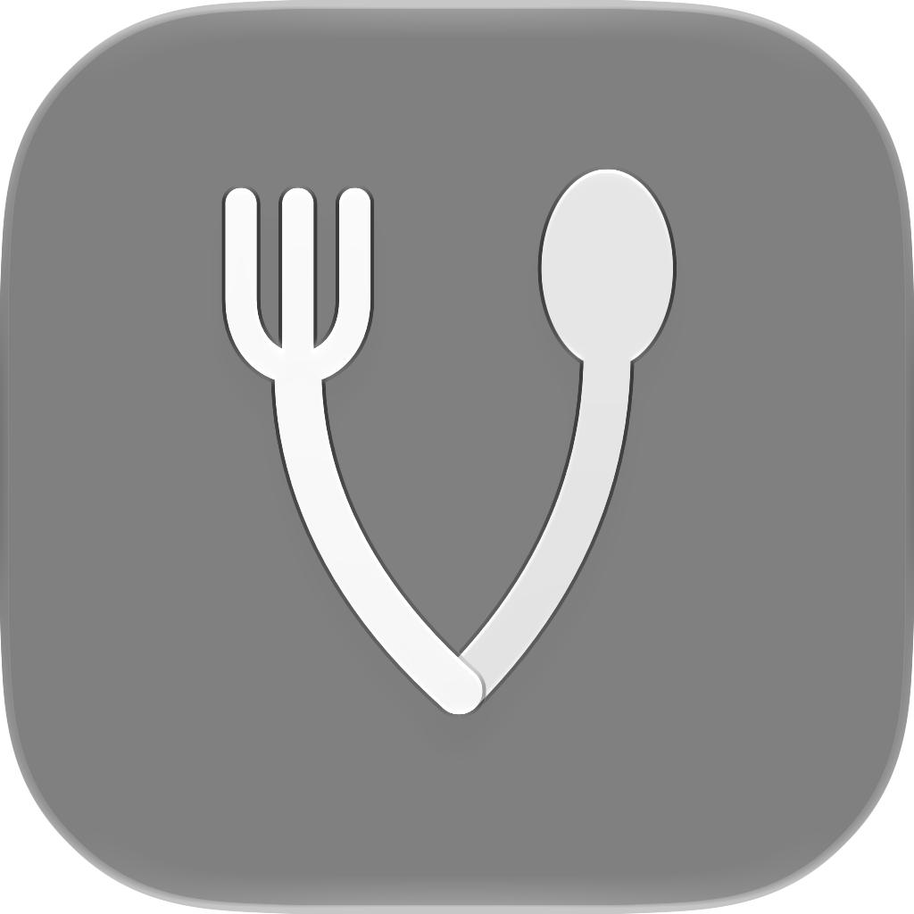
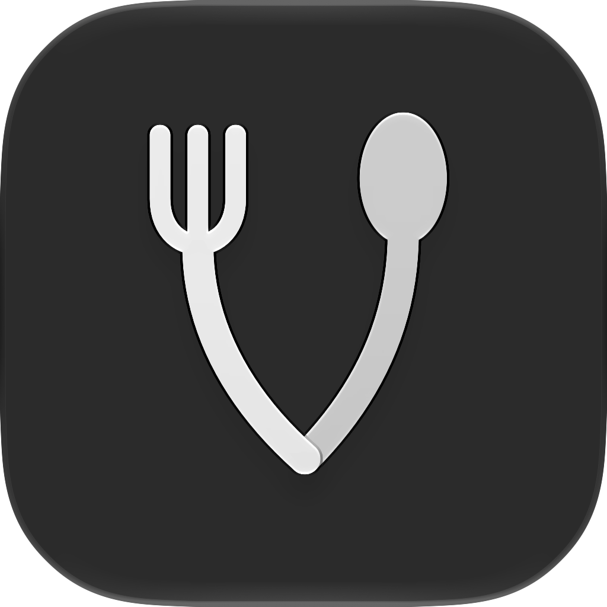
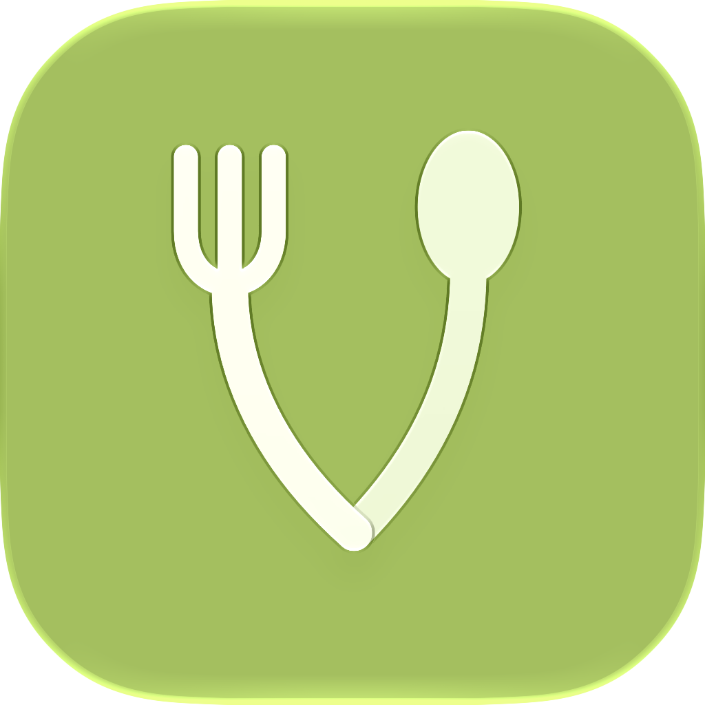
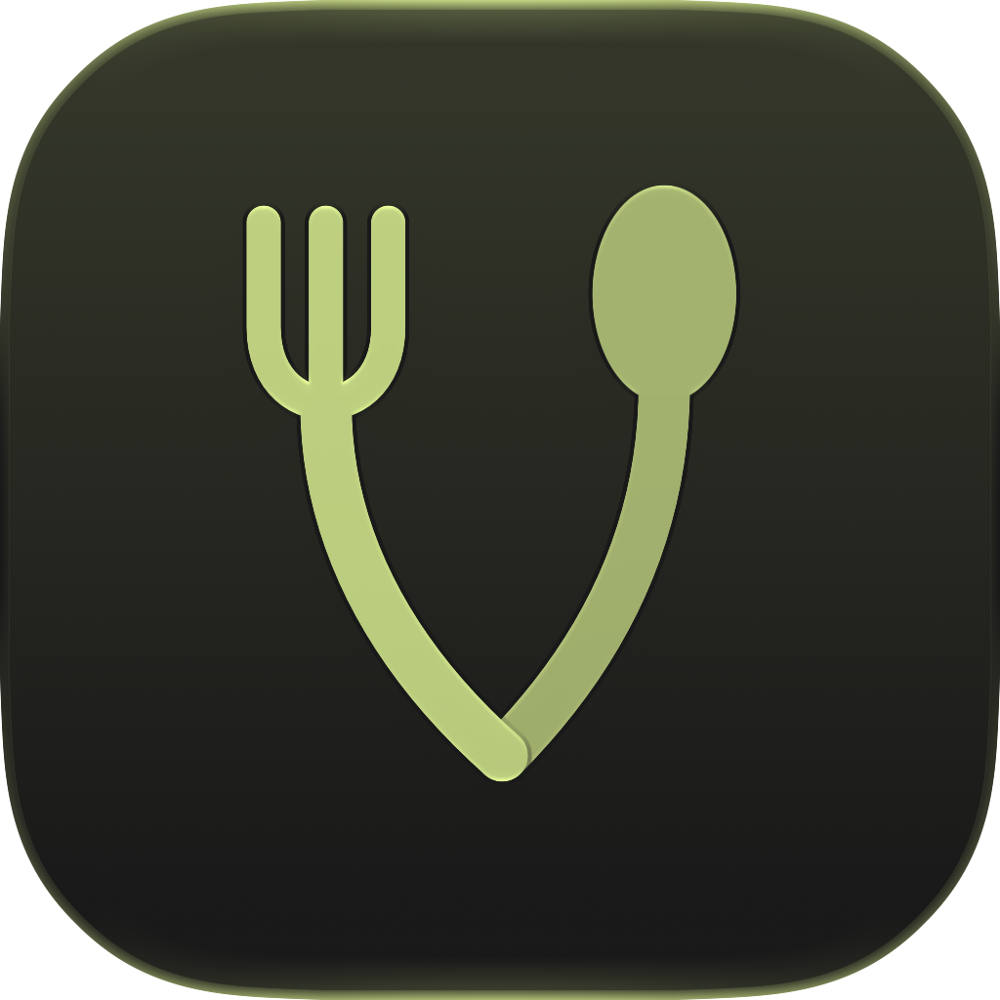

# App icon

The fork and spoon meet in a rounded curve: two people sharing a meal. Ivory and apricot add warmth against deep emerald; the different utensil heads keep the dining cue legible when color is removed. The mark uses two editable SVG layers with native materials, rather than baked highlights or shadows.

Open [AppIcon.icon](../SplitMyMeal-Prod-A/AppIcon.icon) in Apple Icon Composer. The document is integrated through the existing AppIcon build setting and replaces the old flat icon asset. Apple's [Icon Composer integration guidance](https://developer.apple.com/documentation/xcode/creating-your-app-icon-using-icon-composer) describes native appearances and generated fallbacks for earlier systems.

## Native appearance previews

These are actual Icon Composer design-generation 27 exports, not painted simulations. Each row includes the full export and native 60- and 40-pixel renders. Clear exports use the renderer's neutral backdrop; they do not establish wallpaper behavior. Tinted exports show one sample tint.

| Appearance | Preview | 60 pixels | 40 pixels |
| --- | --- | --- | --- |
| Light |  |  |  |
| Dark |  |  |  |
| Clear light |  |  |  |
| Clear dark |  |  |  |
| Tinted light |  |  |  |
| Tinted dark |  |  |  |

## Reproduce the renders

Use the `ictool` executable inside the installed Icon Composer app. Repeat with `Dark`, `ClearLight`, `ClearDark`, `TintedLight` and `TintedDark`, and with widths/heights of 60 and 40. Add `--tint-color 0.42 --tint-strength 0.65` for the sample tinted renders.

```sh
"/Applications/Xcode.app/Contents/Applications/Icon Composer.app/Contents/Executables/ictool" \
  SplitMyMeal-Prod-A/AppIcon.icon --export-image --output-file /tmp/AppIcon-Default.png \
  --platform iOS --rendition Default --width 1024 --height 1024 --scale 1 --design-generation 27
```

[Render provenance](evidence/app-icon/render-provenance.json) records exact source and image hashes. An independent UI reviewer inspected all 18 exports at their original dimensions; no blocking visual finding was identified. This is visual review, not user-recognition research or human taste approval.

## Integration validation — 9 October 2026

Unsigned Release `build analyze` and Debug simulator `build` passed with no warnings or errors, and the Debug app installed on the dedicated iPhone 17 simulator. All 48 build inputs matched before and after. Compiled assets contain Fork/Spoon vectors, native Light/Dark/Tintable image stacks, and generated icon PNGs for the iPhone and iPad. The actual generated 120-pixel fallback was visually inspected and shows this cutlery design. [Build proof](evidence/app-icon/native-build-proof.json) and the [source manifest](evidence/app-icon/source-manifest.json) bind these checks to the final sources; the manifest's Git head is the base commit before the icon change.

The final repository document was opened and visually checked in Icon Composer's generation 27 canvas. Device Hub timed out twice, so installed Home Screen appearance and wallpaper behavior remain unverified. These checks did not launch the app or repeat the app's functional suite; existing walkthroughs and functional test evidence retain their original source bindings.
