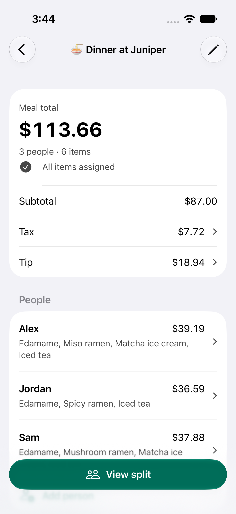
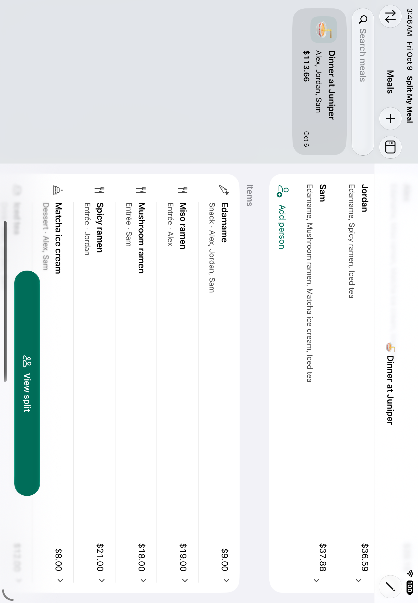

# Split My Meal

[](https://github.com/Shreyasdbz/split-my-meal/actions/workflows/ios.yml)

A native iPhone and iPad app for splitting meal expenses, including proportional tax and tip.

Create a meal, add everyone at the table, and enter the receipt’s items. Assign each item to the people who shared it. Add tax and tip as percentages or fixed amounts, then view or share an itemized split. Assigned shares and any unassigned balance add up to the bill total.

The modernized app uses Swift 6, SwiftUI, SwiftData, native Liquid Glass controls on current systems, and an adaptive iPad layout. It supports restaurant search, optional nearby search, receipt photos with zoom and sharing, searchable meal history, sorting, and confirmed deletion. Existing saved data is migrated without changing stored prices or receipt formats.

The item editor’s Everyone action selects the current people; individual switches remain editable until Save. Exact draft shares show each selected person’s portion before tax and tip. Native amount transitions respect Reduce Motion. A completed allocation says All items assigned, and the split keeps Share split visible. These [research-informed changes](docs/interaction-research.md) are design hypotheses, with validation recorded below.

## Screens and walkthrough



The current native [iPhone](docs/evidence/satisfaction-fullscreen-iphone-walkthrough.mp4) and [iPad](docs/evidence/satisfaction-fullscreen-ipad-walkthrough.mp4) walkthroughs preserve actual interaction speed. [Video provenance](docs/evidence/satisfaction-fullscreen-video-provenance.json) and the [36-state gallery](docs/ui-gallery.md) bind the current screenshots and recordings to passing native Demo cases and matching production source hashes. Captures use fictional meal data; [verification](docs/verification.md) records the complete validation scope.



## Build and test

Open `SplitMyMeal-Prod-A.xcodeproj` in Xcode 27, select the shared `SplitMyMeal-Prod-A` scheme, and run on an iPhone or iPad simulator. The app’s minimum deployment target is iOS 17.4; the current build uses the iOS 27 SDK. For a physical device, use an authorized signing team.

Create dedicated iPhone and iPad simulators in Xcode’s Devices and Simulators window. Before each local run, export `SIMULATOR_UDID` with that dedicated device’s identifier, available from `xcrun simctl list devices available`. Run the full unit and native UI suite:

```sh
SIMULATOR_OS=27.0 SIMULATOR_FAMILY=iPhone scripts/verify-ios.sh
SIMULATOR_OS=27.0 SIMULATOR_FAMILY=iPad scripts/verify-ios.sh
```

Local verification requires an explicit dedicated `SIMULATOR_UDID`; GitHub Actions selects a device on its fresh runner. `ARTIFACTS_DIR` and `DERIVED_DATA_DIR` choose output locations. The script keeps toolchain and runtime metadata, fixture hashes, logs, result bundles, and screenshot attachments. Tests use a separate local store with CloudKit disabled. The script checks the unit host’s native launch metadata; UI tests require and record the isolation argument before each explicit app launch. The script imports two fictional photos into the selected simulator once; reuse preserves the fixture marker, and changed photos or an interrupted import require a fresh dedicated simulator.

The GitHub workflow runs the same suite on iPhone and iPad with Xcode 27 and retains verification artifacts. See [verification](docs/verification.md), [surface review](docs/ui-refinement.md), [architecture](docs/architecture.md), [privacy](misc/PrivacyPolicy.md), and [support](misc/Support.md).
